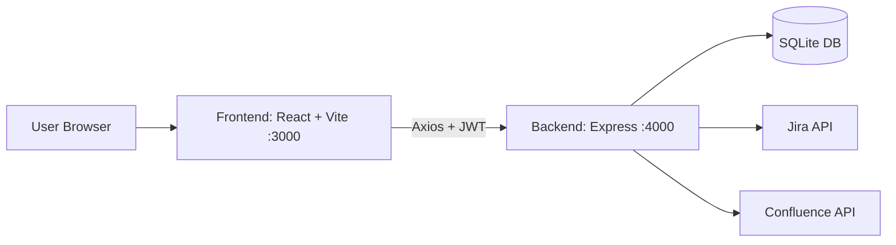

# Capstone Project + Agent Playbook

This guide is the complete operating manual for this repository: what the project does, how it is structured, and exactly which agent to use, when to use it, and what output to expect in an end-to-end SDLC run.

## 1. Project Snapshot

- Project: EPMCDMETST
- Group: mm-learning-group-1
- App type: Brownfield task-management application
- Frontend: React 18 + TypeScript + Vite + Tailwind + React Router + Zustand
- Backend: Node.js + Express + TypeScript + Zod + JWT
- Database: SQLite
- Test stack: Vitest (unit) + Playwright (E2E)

Reference docs:
- [README.md](../README.md)
- [CLAUDE.md](../CLAUDE.md)
- [docs/SDLC_GUIDE.md](./SDLC_GUIDE.md)

## 2. Repository Map

- Frontend app: `frontend/src`
- Backend API: `backend/src`
- E2E tests: `tests/e2e`
- Gherkin features: `tests/features`
- Agent definitions: `.claude/agents`

## 3. Runtime Architecture



Typical request flow:
1. User interacts with React UI.
2. Frontend calls backend REST endpoints with JWT bearer token.
3. Backend validates input using Zod, checks auth middleware, executes DB operations.
4. Backend returns consistent JSON shape: `{ success, data?, error? }`.

## 4. Commands You Will Use Most

Run from repository root.

```bash
npm run install:all
npm run dev
npm run build
npm run test
npm run test:unit
npm run test:e2e
npm run test:report
```

## 5. Agent Catalog (Current .claude/agents)

The currently available local agents are:
- architect-agent
- ba-agent
- business-analyst-assistant
- code-review-agent
- dev-agent
- docs-agent
- qa-agent
- refactor-cleaner-agent
- review-agent
- solution-architect-agent
- unit-tester-agent

### 5.1 SDLC Pipeline Agents

| Agent | Use It When | Main Work | Output / Handoff |
|---|---|---|---|
| ba-agent | Start of a feature cycle | Analyze current app and create Jira Epic/Stories with AC | Jira links + human approval to move into design |
| architect-agent | After stories are approved | Create architecture, HLD/LLD, wireframe guidance, Confluence docs | Confluence links + approval to start development |
| dev-agent | During implementation | Build frontend/backend features and DB changes | Committed code + branch for review/testing |
| qa-agent | After development | Create Gherkin + Playwright E2E coverage and run tests | Test specs + report + quality handoff |
| review-agent | Pre-merge | PR review for correctness and standards | Severity findings + merge/block recommendation |
| docs-agent | End of phase/release | Update README/Confluence/API docs | Published docs links + final review |

### 5.2 Quality and Governance Agents

| Agent | Use It When | Main Work | Output / Handoff |
|---|---|---|---|
| code-review-agent | Need deep quality/security audit | TypeScript/security/standards review | Structured findings table |
| unit-tester-agent | Unit/integration coverage is missing | Add Vitest + supporting tests | New/updated tests + execution guidance |
| solution-architect-agent | Before major design decision/refactor | ADRs, trade-offs, tech debt analysis | Architecture recommendation + effort estimate |
| refactor-cleaner-agent | Cleanup/refactor pass before release | Remove dead code/unused imports/deps | Cleanup diff + risk notes |
| business-analyst-assistant | Need strict user-story drafting format | Produces tightly structured story draft template | Story document ready for Jira/BA review |

## 6. End-to-End SDLC Playbook (What to Run, In Order)

### Phase 0: Setup and Environment

1. Configure env vars via `.env` from `.env.example`.
2. Install dependencies with `npm run install:all`.
3. Start the app with `npm run dev`.
4. Confirm frontend and backend are reachable.

### Phase 1: Requirements (BA)

Use: `ba-agent`

Goal:
- Identify feature gaps.
- Create Jira Epic + Stories with acceptance criteria.

Suggested prompt:
```text
@ba-agent Analyze frontend/src and backend/src, identify top 5 enhancements, and create Epic + Stories in EPMCDMETST with acceptance criteria.
```

Exit criteria:
- Epic and stories created.
- Human approves stories in Jira.

### Phase 2: Solution Design

Use: `architect-agent`

Goal:
- Architecture overview
- HLD and LLD
- Mermaid diagrams
- Confluence publishing

Suggested prompt:
```text
@architect-agent Create architecture, HLD, and LLD for approved stories and publish to Confluence with links.
```

Exit criteria:
- Confluence links delivered.
- Human approves design.

### Phase 3: Implementation

Use: `dev-agent`

Goal:
- Implement feature per Jira story.
- Respect current project patterns.

Suggested prompt:
```text
@dev-agent Implement EPMCDMETST-12345 end-to-end (frontend + backend + validation + DB if needed) and commit with story key.
```

Exit criteria:
- Code committed on feature branch.
- Human reviews diff.

### Phase 4: Test Coverage

Use: `unit-tester-agent` and `qa-agent`

Goal:
- Add/adjust unit tests for changed logic.
- Add E2E flows for user-visible behavior.

Suggested prompts:
```text
@unit-tester-agent Add Vitest coverage for the changed frontend store and backend service.
@qa-agent Add Playwright E2E happy path + error path for EPMCDMETST-12345 and run tests.
```

Exit criteria:
- Relevant unit tests pass.
- E2E tests pass and report generated.

### Phase 5: Review and Risk Gate

Use: `review-agent` and optionally `code-review-agent`

Goal:
- Validate correctness, standards, security, and regression risk.

Suggested prompts:
```text
@review-agent Review current branch vs main and summarize critical/warning findings.
@code-review-agent Audit backend route and frontend page changes for TS, security, and standards.
```

Exit criteria:
- Critical findings are resolved.
- Human approves PR readiness.

### Phase 6: Documentation and Closure

Use: `docs-agent`

Goal:
- Update release-facing docs and implementation notes.

Suggested prompt:
```text
@docs-agent Update README and Confluence pages for implemented stories and include test evidence links.
```

Exit criteria:
- Docs updated and reviewed.
- Release/deployment handoff complete.

### Optional Continuous Improvement Phase

Use: `solution-architect-agent` and `refactor-cleaner-agent`

Goal:
- Capture architectural debt and perform safe cleanup.

Suggested prompts:
```text
@solution-architect-agent Create ADR for scaling risks introduced by the latest feature and estimate effort.
@refactor-cleaner-agent Identify safe cleanup opportunities in modified modules and propose minimal-risk refactors.
```

## 7. Decision Matrix: Which Agent Should I Call Right Now?

| Situation | Primary Agent | Secondary Agent |
|---|---|---|
| Need stories/requirements | ba-agent | business-analyst-assistant |
| Need architecture docs | architect-agent | solution-architect-agent |
| Need coding done | dev-agent | code-review-agent |
| Need tests added | unit-tester-agent | qa-agent |
| Need PR review | review-agent | code-review-agent |
| Need documentation updates | docs-agent | architect-agent |
| Need cleanup before release | refactor-cleaner-agent | review-agent |

## 8. Human-in-the-Loop Checkpoints (Mandatory)

Pause for human approval at these points:
1. After Jira story creation
2. After architecture/HLD/LLD publication
3. After feature implementation commit
4. After tests and review findings
5. Before merge/release

## 9. Practical Prompt Templates You Can Reuse

```text
@ba-agent Analyze current app and generate 3-5 Jira stories for highest-value improvements.
@architect-agent Build HLD/LLD with API contract and sequence diagrams for approved stories.
@dev-agent Implement <JIRA-KEY> end-to-end and keep API response shape consistent.
@unit-tester-agent Add focused tests for changed logic and edge cases.
@qa-agent Add E2E coverage for happy path, auth boundary, and one error path.
@review-agent Review this branch against main and block on critical issues.
@docs-agent Update README + Confluence artifacts for this release.
```

## 10. Troubleshooting and Guardrails

### Unsupported model error
If a command fails with a message like:
- `400 The requested model is not supported`

Do this:
1. Stop retrying the same model-specific request.
2. Run assistant/model discovery again: `codemie setup assistants`.
3. Use workspace default assistant/model instead of forcing unsupported model.
4. Continue the workflow and report fallback used.

### Common terminal pitfall
If you see a typo such as `cd frondend`, correct to `cd frontend` and rerun.

## 11. Definition of Done for One Story

A story is complete when all are true:
1. Implementation merged with story-keyed commit history.
2. Unit + E2E coverage added for changed behavior.
3. Review findings resolved (no unresolved critical issues).
4. Documentation updated.
5. Human approval captured.

## 12. Recommended Daily Operating Rhythm

1. Start with BA or story selection.
2. Design only what is needed for today.
3. Implement one story slice at a time.
4. Add tests in same iteration.
5. Run review gate before merge.
6. Update docs before close.

This sequence keeps changes small, reviewable, and aligned to the project SDLC model.
