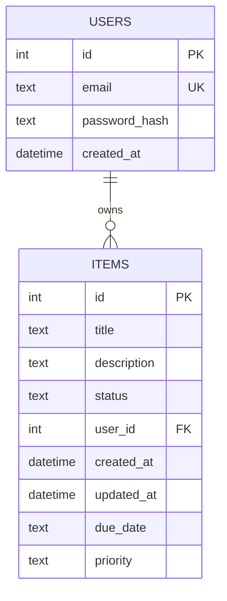
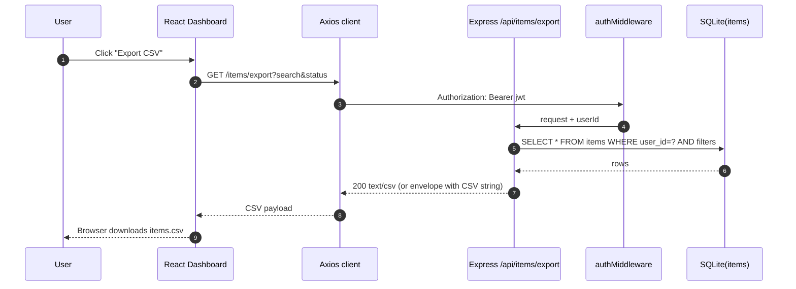

# Architecture Pack — Improve Item Management (Due dates, Priority, Export)

**Jira stories**:
- **EPMCDMETST-55847** — Improve item management (due dates, priority, export)
- **EPMCDMETST-55844** — Add due date support for items
- **EPMCDMETST-55845** — Add item priority (High/Medium/Low)
- **EPMCDMETST-55846** — Export items list to CSV

**Scope**: Extend existing brownfield task-management app to support `due_date`, `priority`, and CSV export of the user’s current filtered list.

**Non-goals** (unless separately requested):
- Sharing items across users
- Calendar integrations / reminders
- Bulk edit

---

## 1. Architecture Overview

### 1.1 Current baseline (brownfield)
- **Frontend**: React 18 + TypeScript + Vite, React Router v6, Zustand auth store.
- **Backend**: Node.js 20 + Express + TypeScript.
- **DB**: SQLite (via `@libsql/client` file: DB).
- **Auth**: JWT HS256 via `backend/src/middleware/auth.ts` (auth guard) and Axios token injection `frontend/src/api/client.ts`.

### 1.2 Enhancement summary
This change extends the existing **Item** entity and its CRUD APIs.

- **Due Date**: optional date for an item (stored as ISO date string, e.g. `YYYY-MM-DD`)
- **Priority**: optional enum: `low | medium | high` (default `medium`)
- **Export**: new API to export current user’s filtered list (search + status + sorting) as CSV; frontend provides button to download.

### 1.3 Key constraints / “do not redesign” critical paths
The following files must be extended without redesigning their responsibility boundaries:
- `backend/src/middleware/auth.ts`
- `backend/src/db/init.ts`
- `frontend/src/store/authStore.ts`
- `frontend/src/api/client.ts`

---

## 2. Component Diagram (Mermaid)

```mermaid
flowchart LR
  subgraph Browser
    UI[React UI\n(Dashboard, ItemForm, ItemCard, Filters)]
    AX[Axios client\nfrontend/src/api/client.ts]
    ZS[Zustand Auth Store\nfrontend/src/store/authStore.ts]
  end

  subgraph Backend[Node.js 20 + Express API]
    RT[Routes\n/items]
    AU[JWT Auth Middleware\nbackend/src/middleware/auth.ts]
    ZV[Zod Validation\ncreate/patch/export schemas]
    QS[Query Builder\nWHERE user_id + search + status]
  end

  subgraph DB[SQLite file via @libsql/client]
    IT[(items)]
    US[(users)]
  end

  UI --> AX
  AX -->|Authorization: Bearer jwt| AU
  AU --> RT
  RT --> ZV
  RT --> QS
  QS --> IT
  IT --- US
  UI <--> ZS
```

---

## 3. Data Model (ERD-lite)



---

## 4. Cross-cutting concerns

### 4.1 Security
- All item APIs remain protected by `authMiddleware` (JWT).
- Export endpoint returns only authenticated user’s items and uses the same filter logic as GET `/items`.

### 4.2 Validation and envelope
- All APIs return envelope: `{ success: boolean, data?: T, error?: string }`.
- Backend validates request bodies using Zod.

### 4.3 Backward compatibility
- Existing items without `due_date`/`priority` remain valid.
- Default `priority` = `medium` at API level; DB values can be `NULL` initially and normalized via migration.

---

## 5. Sequence Diagram — Export CSV



---

## 6. Deployment impact
- No new runtime services.
- DB migration will occur on backend start in `initDb()`.
- CI: add/update unit tests + E2E tests; Playwright downloads file (or checks response header) for export.
