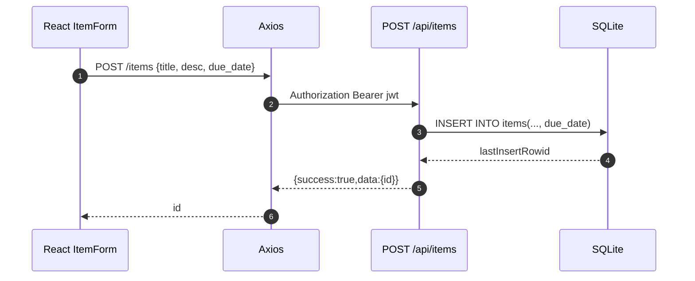
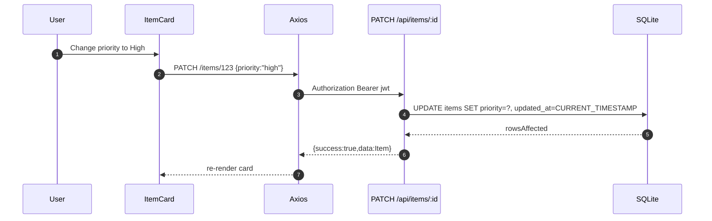
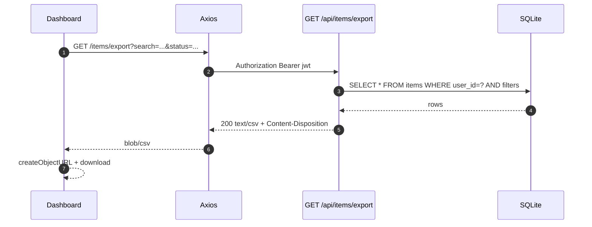

# LLD — Improve Item Management (Due dates, Priority, Export)

**Stories**: EPMCDMETST-55847 / 55844 / 55845 / 55846

This LLD is split by feature, but implemented as one cohesive enhancement to the existing Items module.

---

## Feature A — Due Date support (EPMCDMETST-55844)

### A1. React component tree + `data-testid`
**Page:** `frontend/src/pages/Dashboard.tsx`

Proposed UI additions (minimal brownfield change):
- Extend existing `ItemForm` with a due date input
- Extend `ItemCard` to show due date (and optionally “overdue” state)

Component tree:
- `Dashboard`
  - `Navbar`
  - `ItemForm`
    - `input[data-testid=item-title-input]`
    - `input[data-testid=item-desc-input]`
    - **NEW** `input[type=date][data-testid=item-due-date-input]`
    - `button[data-testid=add-item-button]`
  - `SearchBar` (existing)
  - `StatusFilter` (existing)
  - **NEW (optional, if we add filtering)** `PriorityFilter`
  - `ItemList`
    - `ItemCard`
      - **NEW** `span[data-testid=item-due-date-<id>]`

Wireframe (Dashboard toolbar):
- Row1: “Add New Item” form (Title | Description | Due Date | Priority | Add)
- Row2: Search input + Status dropdown + Export CSV button

### A2. API endpoint(s)

#### POST `/api/items`
**Request body (Zod)**
```ts
z.object({
  title: z.string().min(1),
  description: z.string().optional(),
  due_date: z.string().regex(/^\d{4}-\d{2}-\d{2}$/).optional().nullable(),
  priority: z.enum(['low','medium','high']).optional(),
})
```

**Response shape**
```ts
{ success: true, data: { id: number } }
```

#### PATCH `/api/items/:id`
**Request body (Zod)**
```ts
z.object({
  title: z.string().min(1).optional(),
  description: z.string().optional(),
  status: z.enum(['active','completed','archived']).optional(),
  due_date: z.string().regex(/^\d{4}-\d{2}-\d{2}$/).optional().nullable(),
  priority: z.enum(['low','medium','high']).optional(),
})
```

**Response shape**
```ts
{ success: true, data: Item }
```

### A3. DB schema change
In `backend/src/db/init.ts` (migration style consistent with existing `updated_at` migration):

```sql
ALTER TABLE items ADD COLUMN due_date TEXT;
```

Notes:
- Store due date as `TEXT` in ISO `YYYY-MM-DD` to keep SQLite comparisons simple.

### A4. Sequence diagram (Mermaid) — create item with due date


### A5. Playwright E2E scenario summary
- Login
- Add item with due date
- Assert due date is displayed on item card
- Edit due date (if UI supports editing inline or via modal) OR via API update and refresh (preferred: UI)

### A6. Vitest unit test points
- Frontend:
  - `items.ts` client methods include `due_date` in create/update payload
- Backend:
  - Zod schema rejects invalid date formats
  - PATCH updates `due_date` and sets `updated_at`

---

## Feature B — Priority support (EPMCDMETST-55845)

### B1. React component tree + `data-testid`
- `ItemForm`
  - **NEW** `select[data-testid=item-priority-select]` with options: Low/Medium/High
- `ItemCard`
  - **NEW** `span[data-testid=item-priority-<id>]` showing badge

### B2. API endpoints
Reuses POST/PATCH described above.

### B3. DB schema change
```sql
ALTER TABLE items ADD COLUMN priority TEXT;
```

Defaulting rules:
- API: if missing, treat as `medium`.
- DB: allow NULL; normalize to `medium` when returning (or set default on insert).

### B4. Sequence diagram — patch priority


### B5. Playwright E2E scenario summary
- Add item with priority High
- Verify badge shows “high”
- Change to Low and verify updated

### B6. Vitest unit test points
- Backend: priority enum validation
- Frontend: rendering mapping high/medium/low → badge color

---

## Feature C — Export items list to CSV (EPMCDMETST-55846)

### C1. React component tree + `data-testid`
Add an export button to the Dashboard controls area:
- `Dashboard`
  - **NEW** `button[data-testid=export-csv-button]`

Optional:
- show toast message on success/failure (reuse existing patterns if any).

### C2. API endpoint

#### GET `/api/items/export`
**Query params**
- `search?: string`
- `status?: 'active'|'completed'|'archived'|'all'`
- `priority?: 'low'|'medium'|'high'|'all'` (optional; can be added now or later)

**Response**
Two acceptable shapes (pick one implementation and document it):
1) **Streaming CSV** (preferred):
- `200` with `Content-Type: text/csv`
- `Content-Disposition: attachment; filename="items.csv"`
- body: CSV string

2) Envelope containing CSV string:
```ts
{ success: true, data: { csv: string } }
```

Recommendation: use streaming CSV response for better UX and simple download.

### C3. DB usage
Export uses the same WHERE logic as list API:
- always enforce `user_id = ?`
- apply `search` on `title` + `description`
- apply `status` filter
- apply `priority` filter (if enabled)

### C4. Sequence diagram — export


### C5. Playwright E2E scenario summary
- Login
- Create 2-3 items (different priority/due dates)
- Apply a filter/search
- Click Export CSV
- Assert a download event occurs and file contains expected rows

### C6. Vitest unit test points
- Backend: CSV output includes headers and correct escaping
- Frontend: export function calls endpoint with current query params

---

## DB Migration Plan (combined)
Update `backend/src/db/init.ts`:
1. Check `PRAGMA table_info(items)` for `due_date` column; if missing, `ALTER TABLE ...`.
2. Check for `priority` column; if missing, `ALTER TABLE ...`.

---

## Notes on Types
Update `frontend/src/types` (Item shape) to include:
- `due_date?: string | null`
- `priority?: 'low'|'medium'|'high' | null`

---

## Risks / Tech Debt
- `frontend/src/types/index.ts` appears unreadable (binary) in the current repo tool output; confirm it is valid TypeScript and not corrupted.
- Export endpoint introduces non-envelope response if we choose streaming; confirm API convention acceptance. If strict convention required, use envelope and download via Blob.
